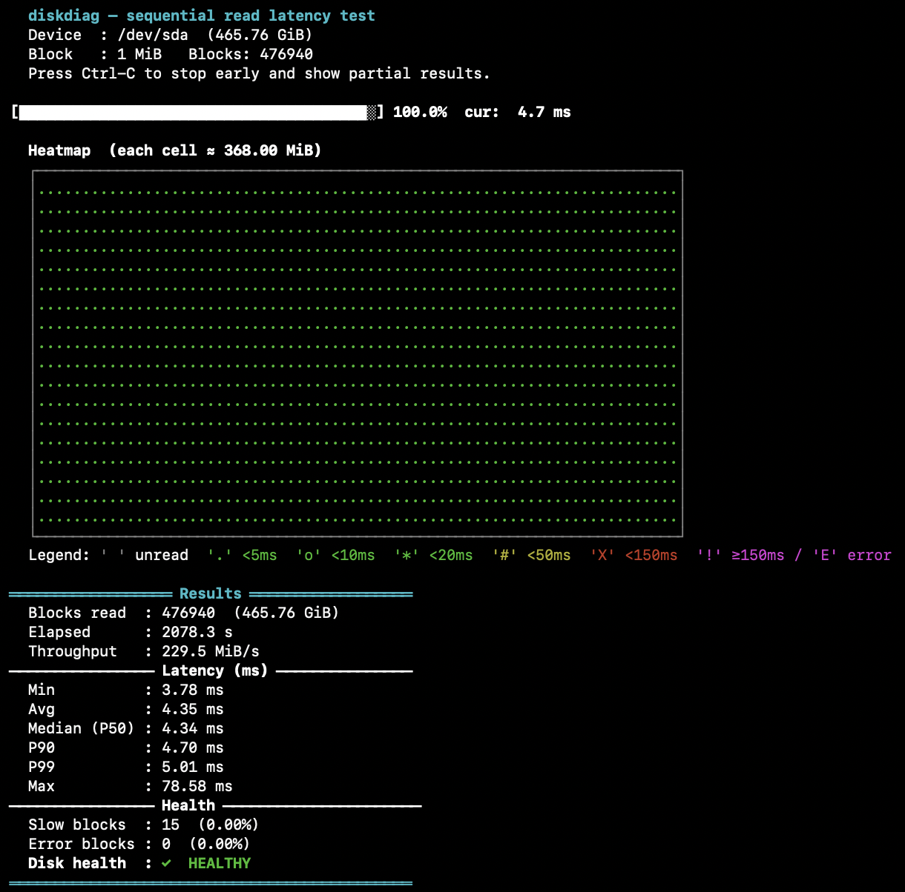

# diskdiag

A command-line tool for disk diagnostics based on sequential read latency
measurement. Unlike SMART attribute readers, diskdiag exercises the actual
read path and can reveal degraded areas, ageing HDD heads, or failing flash
cells.

Supports **Linux** and **macOS**.



## Dependencies

Only the standard C library and system headers are required.
No external dependencies.

| Platform | Compiler | Notes |
|----------|----------|-------|
| Linux | `gcc` | `build-essential` package on Debian/Ubuntu, `gcc` on Fedora |
| macOS | `clang` or `gcc` | Xcode Command Line Tools: `xcode-select --install` |

## Build and install

Clone the repository and build:

```bash
git clone https://github.com/kixel-cz/diskdiag.git
cd diskdiag
make
sudo make install          # installs to /usr/local/bin
```

With a custom prefix:

```bash
sudo make install PREFIX=/usr
```

Uninstall:

```bash
sudo make uninstall
```

## Usage

```
sudo diskdiag [OPTIONS] <device>
```

### Device names by platform

| Platform | Example devices |
|----------|----------------|
| Linux | `/dev/sda`, `/dev/sdb`, `/dev/nvme0n1` |
| macOS | `/dev/disk0`, `/dev/disk2` |

On macOS, use `diskutil list` to identify the correct device before testing.

### Options

| Option | Description |
|--------|-------------|
| `-b, --block-size <MiB>` | Read block size, 1–1024 (default: 1) |
| `-n, --blocks <N>` | Test only the first N blocks |
| `-o, --offset <N>` | Start at block offset N |
| `--threshold-warn <ms/MiB>` | Slow block threshold (default: 20 ms/MiB) |
| `--threshold-critical <ms/MiB>` | Critical latency threshold (default: 150 ms/MiB) |
| `-y, --yes` | Skip the mounted-device prompt |
| `-q, --quiet` | Suppress progress bar and heatmap; print only the statistics table |
| `-j, --json` | Output results as JSON |
| `--no-color` | Disable ANSI colour output |
| `-h, --help` | Show help |

Latency thresholds are specified in **ms/MiB** (milliseconds per mebibyte),
which makes results comparable regardless of the block size used. A 4 MiB
block read in 16 ms and a 1 MiB block read in 4 ms both equal 4 ms/MiB.

### Exit codes

| Code | Meaning |
|------|---------|
| `0` | **HEALTHY** – < 1 % slow blocks, no errors |
| `1` | **GOOD** – 1–5 % slow blocks |
| `2` | **FAIR** – > 5 % slow blocks |
| `3` | **POOR** – critical latency or I/O errors detected |
| `4` | Runtime error (bad arguments, cannot open device, ...) |

## Examples

```bash
# Full test with default settings
sudo diskdiag /dev/sdb            # Linux
sudo diskdiag /dev/disk2          # macOS

# Larger blocks – faster pass, same latency scale
sudo diskdiag -b 4 /dev/sdb

# Quick smoke test of the first 1000 blocks
sudo diskdiag -n 1000 /dev/sdb

# Test a specific region (blocks 500–999)
sudo diskdiag -o 500 -n 500 /dev/sdb

# Tighter thresholds for NVMe drives
sudo diskdiag --threshold-warn 2 --threshold-critical 20 /dev/nvme0n1

# Non-interactive JSON output for scripts or monitoring pipelines
sudo diskdiag -y -q --json /dev/sdb > result.json

# Use the exit code in a shell script
sudo diskdiag -y -q /dev/sdb
case $? in
  0) echo "Healthy" ;;
  1) echo "Good" ;;
  2) echo "Fair – investigation recommended" ;;
  3) echo "POOR – immediate attention required" ;;
esac
```

Press **Ctrl-C** at any time to stop early; the heatmap and statistics are
printed immediately from the portion of the disk read so far.

## Output

### Progress bar

Shows completion percentage and the normalized latency of the most recently
read block in ms/MiB.

### ASCII heatmap

Each cell represents the **worst** (highest) normalized latency recorded in
that region of the disk. Using the worst value rather than the average ensures
that isolated slow blocks or I/O errors are always visible and cannot be hidden
by surrounding fast reads.

Latency is normalized to ms/MiB so the heatmap looks the same regardless of
block size. Characters and colours encode the latency relative to the configured
thresholds:

| Char | Colour  | Latency                  |
|------|---------|--------------------------|
| `.`  | green   | < warn / 4               |
| `o`  | green   | < warn / 2               |
| `*`  | green   | < warn threshold         |
| `#`  | yellow  | < critical / 3           |
| `X`  | red     | < critical threshold     |
| `!`  | magenta | >= critical threshold    |
| `E`  | magenta | I/O error                |

### Statistics

Minimum, average, median (P50), P90, P99, and maximum latency in ms/MiB;
throughput in MiB/s; count of slow, critical, and I/O error blocks.

### Health rating

| Rating  | Condition                                       |
|---------|-------------------------------------------------|
| HEALTHY | < 1 % slow blocks, no critical blocks or errors |
| GOOD    | 1–5 % slow blocks                               |
| FAIR    | > 5 % slow blocks                               |
| POOR    | critical latency blocks or I/O errors detected  |

### JSON output

When `-j / --json` is used, results are written to stdout as a single JSON
object. Mount warnings are still printed to stderr so they do not interfere
with downstream parsing. The device path is properly escaped in the JSON output.

```json
{
  "device": "/dev/sdb",
  "block_mib": 1,
  "offset_blocks": 0,
  "blocks_read": 7452,
  "bytes_read": 7812808704,
  "elapsed_s": 142.551,
  "throughput_mib_s": 52.14,
  "latency_ms_per_mib": {
    "min": 4.123,
    "avg": 9.847,
    "p50": 8.901,
    "p90": 14.233,
    "p99": 38.441,
    "max": 187.002
  },
  "thresholds_ms_per_mib": { "warn": 20, "critical": 150 },
  "slow_blocks": 312,
  "critical_blocks": 3,
  "io_errors": 1,
  "slow_pct": 4.1867,
  "critical_pct": 0.0403,
  "io_error_pct": 0.0134,
  "health": "POOR",
  "exit_code": 3
}
```

## Notes

**The disk does not need to be unmounted.** Read-only access cannot corrupt
data. If the device is currently mounted, diskdiag prints a warning to stderr
and asks for confirmation. Pass `-y / --yes` to skip the prompt in automated
use. Results may be skewed by concurrent OS I/O (journaling, writeback,
prefetch); for precise diagnostics unmount the disk first.

The device is opened with `O_DIRECT` (Linux) or `F_NOCACHE` (macOS) to
bypass the page cache, so latency reflects actual media performance rather
than RAM speed.

Colour output is automatically disabled when stdout is not a terminal
(pipe, redirect). Use `--no-color` to force it off in any context.

### macOS system disk

On macOS 10.15 and later, the system volume is protected by System Integrity
Protection (SIP) and mounted as a read-only snapshot. Direct access via
`/dev/diskX` is blocked even for root. This affects only the system disk —
external and secondary drives work without any restrictions.

To identify available disks on macOS:

```bash
diskutil list
```

### Interpreting results

Latency is normalized to ms/MiB, making results independent of block size.
The numbers below assume a quality controller and a fast bus. Real-world
results can differ significantly depending on the controller and connection.

**Typical reference values:**

| Drive type      | Expected latency |
|-----------------|------------------|
| NVMe SSD        | < 1 ms/MiB       |
| SATA SSD        | 1–5 ms/MiB       |
| HDD (healthy)   | 5–20 ms/MiB      |
| HDD (degraded)  | > 50 ms/MiB      |

**Controller and bus impact:**

A slow or low-quality controller can add several milliseconds of overhead
regardless of the drive itself. Budget USB enclosures and chipsets are a
common culprit — the drive may be perfectly healthy while the enclosure
limits throughput and inflates latency.

| Interface      | Typical throughput |
|----------------|--------------------|
| USB 1.1        | ~1 MB/s            |
| USB 2.0        | ~40 MB/s           |
| USB 3.2 Gen 1  | ~400 MB/s          |
| USB 3.2 Gen 2  | ~900 MB/s          |
| Thunderbolt 3/4| ~2500 MB/s         |

An HDD connected over USB 2.0 may show elevated latency not because the drive
is failing, but because the bus itself is the bottleneck. If results look
unexpectedly poor, try a different cable, port, or enclosure before drawing
conclusions about the drive's health.

**Remote use:** if you plan to detach from the terminal (tmux, screen) or
run over SSH, use `-q` from the start to avoid the progress bar filling the
scroll buffer:

```bash
nohup sudo diskdiag -q /dev/sdb > result.txt 2>&1 &
```

## Man page

A man page is included and installed automatically by `make install`:

```bash
man diskdiag
```

## License

Licensed under the [European Union Public Licence v1.2 (EUPL-1.2)](LICENSE),
a copyleft licence compatible with GPL-2.0, LGPL, MPL, and several others.

## See also

`smartctl(8)`, `hdparm(8)`, `badblocks(8)`, `nvme(1)`, `diskutil(8)`
